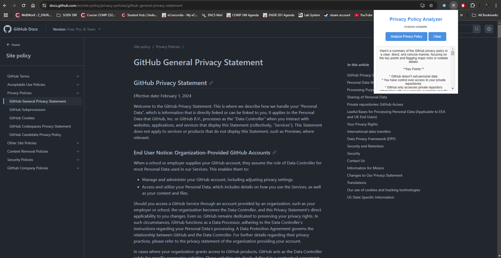
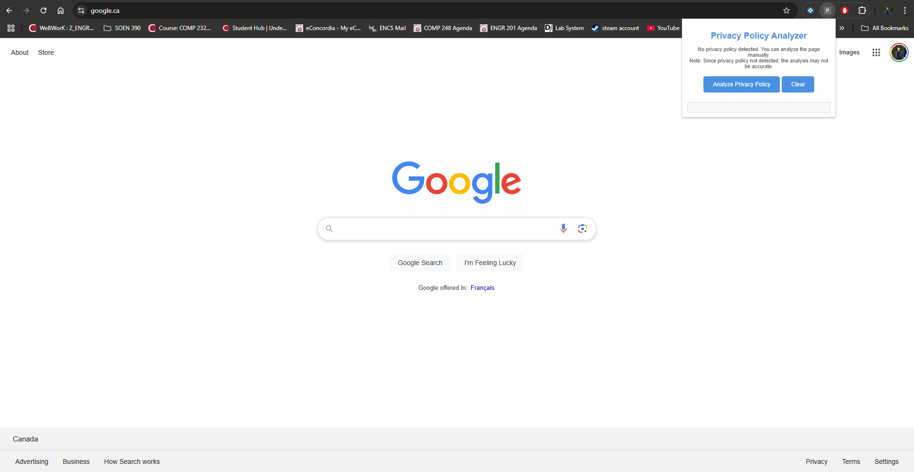

# privacy-extension

# Privacy Policy Analyzer Chrome Extension

## Overview

The Privacy Policy Analyzer is a Chrome extension designed to simplify and demystify privacy policies on the web. It uses the GroqCloud API, a powerful natural language processing tool, to summarize privacy policies and flag potential risks or areas of concern. This tool is perfect for users who want quick, actionable insights into how their personal data might be handled without needing to read through lengthy and complex documents.

## How can this help?

In an era where privacy is a major concern, many websites bury critical details in dense and jargon-heavy privacy policies. Users often lack the time or expertise to fully understand these policies, leaving them vulnerable to risks such as:

* Unintended Data Sharing: Information shared with third parties or through integrations.
* Inadequate Data Security: Lack of clear assurances about how data is stored or protected.
* Data Retention Ambiguity: No clarity on how long data is kept.

This extension empowers users by:

* Summarizing privacy policies into key points.
* Highlighting potential risks or concerns.
* Making it easier to understand how data is collected, used, and shared.

---

## Features

* **Automated Summaries:** Generates concise summaries of privacy policies, saving users time.
* **Risk Identification:** Flags potential risks, such as data sharing practices and unclear retention policies.
* **User-Friendly Interface:** A simple and accessible Chrome extension.
* **Customizable:** Allows users to integrate their own GroqCloud API key for processing.

---

## Setup Instructions

Follow the steps below to set up and start using the Privacy Policy Analyzer:

1. **Clone the Repository**

   Use the following commands to clone the repository and navigate into the project folder:

   ```bash
   git clone [https://github.com/your-username/privacy-policy-analyzer.git](https://github.com/your-username/privacy-policy-analyzer.git)
   cd privacy-policy-analyzer
   ```

2. **Obtain a GroqCloud API Key**

   Visit GroqCloud and sign up for an account.
   Navigate to the API Keys section and generate an API key.
   Copy the API key—you’ll need it later.

3. **Load the Extension into Chrome**

   Open Chrome and navigate to `chrome://extensions`.
   Toggle Developer Mode in the top-right corner of the page.
   Click Load unpacked and select the folder where you cloned the repository.

4. **Set Up the GroqCloud API Key**

   Open a webpage that contains a privacy policy you want to analyze.
   Click the extension icon in the Chrome toolbar to activate it.
   Open Chrome’s Developer Tools:
      Right-click anywhere on the page and select Inspect.
      Navigate to the Console tab in the Developer Tools.
   Run the following command, replacing "your_groq_api_key" with your actual GroqCloud API key:

   ```javascript
   chrome.storage.local.set({ groqcloudApiKey: "your_groq_api_key" });
   ```
---

## How to Use
1. Navigate to any webpage with a privacy policy you want to analyze.
2. Click the Privacy Policy Analyzer extension icon in the Chrome toolbar.
3. The extension will:
   - Preprocess and summarize the privacy policy.
   - Highlight flagged risks or concerns in the summary.
4. Review the output directly in the extension popup.

---

## Demo



Automatically detect if the page is really a privacy policy page:
